# Architecture

How PocketExit is put together and why. The wire formats live in
[PROTOCOL.md](PROTOCOL.md); the personal-mode contract lives in
[docs/pairing-protocol.md](docs/pairing-protocol.md).

## Design goals

PocketExit is designed for a small, owner-operated set of unrooted Android
phones. Its priorities are:

1. independent control and exit routing;
2. no inbound listener on a phone;
3. no root, ADB, VPN service, or device-wide route override;
4. one gateway, whether that is a deployed host or a laptop;
5. QUIC on the mobile-facing path where the path allows it;
6. TCP and UDP proxy support;
7. explicit authentication and conservative destination filtering.

## Two modes, one binary

`backend/cmd/server` is one program with two entry points. A bare invocation is
server mode, configured entirely by the environment, exactly as it has always
been. `pocketexit personal` is the zero-server path.

Everything personal mode adds is additive and gated on `config.Mode`:
`config.Personal()` builds the same `Config` struct the environment loader
builds, `httpapi.NewPersonal` builds the same `Server` with a different token
store, and the pairing routes and the static dashboard handler are only mounted
when `Mode == ModePersonal`. Server mode routes byte for byte as before.

| | Server mode | Personal mode |
|---|---|---|
| TLS | nginx terminates it | the Go process terminates it |
| Dashboard | served by nginx | served by the process from `frontend/` |
| Agent tokens | `personal.NewStaticTokenStore(AGENT_TOKENS_JSON)` | `personal.Store`, persisted in `state.json` |
| Adding a node | edit the environment, restart | `POST /pair/v1/claim` with a live code |
| Removing a node | edit the environment, restart | `DELETE /api/v1/nodes/{nodeID}`, revokes the token |
| Log console | JSON | text, because a person is reading it |

The audit file is always JSON Lines whatever the console does: it is named
`.jsonl`, tooling is pointed at it, and a file whose lines do not parse is
worse than no file. `fanOutHandler` in `cmd/server/main.go` writes each record
to both handlers.

## Components

### nginx gateway — server mode only

nginx is the only container with published host ports.

| Port | Transport | Purpose |
|---|---|---|
| 80 | TCP | HTTPS redirect |
| 443 | TCP | HTTPS and HTTP/2 |
| 443 | UDP | HTTP/3 / QUIC |
| 1080 | TCP | Authenticated SOCKS5 |
| 1081 | TLS/TCP | TLS-wrapped authenticated SOCKS5 |
| 12000–12031 | UDP | Dynamically allocated SOCKS5 UDP relays |

nginx serves the static dashboard, reverse-proxies `/api/` and `/agent/` to the
Go backend, and upgrades circuit requests to WebSockets. Port 1080 is the raw
SOCKS endpoint for trusted networks; port 1081 adds an outer TLS session for a
TLS-wrapper client.

HTTP/3 terminates at nginx, which forwards the private hop to Go over HTTP/1.1
on the Compose bridge. Control requests may use HTTP/3 while circuit data uses
an authenticated WebSocket, which hosted connectors relay without the
request-body streaming timeouts that ended sustained v0.3.0 transfers.

In personal mode there is no nginx. The Go process owns TLS, the dashboard, and
the content security policy nginx would otherwise apply.

### Go backend

Four logical subsystems:

```text
HTTP API ───────────────┐
Node registry ──────────┼── Circuit manager ── pipes + quotas
SOCKS5 TCP/UDP server ──┤
Scheduler ──────────────┘
```

The node registry stores the latest heartbeat and a bounded command queue for
every registered phone. Each proxy connection creates one circuit, and the
circuit manager owns two in-memory pipes per circuit:

```text
client → phone: down pipe
phone  → client: up pipe
```

### Android agent

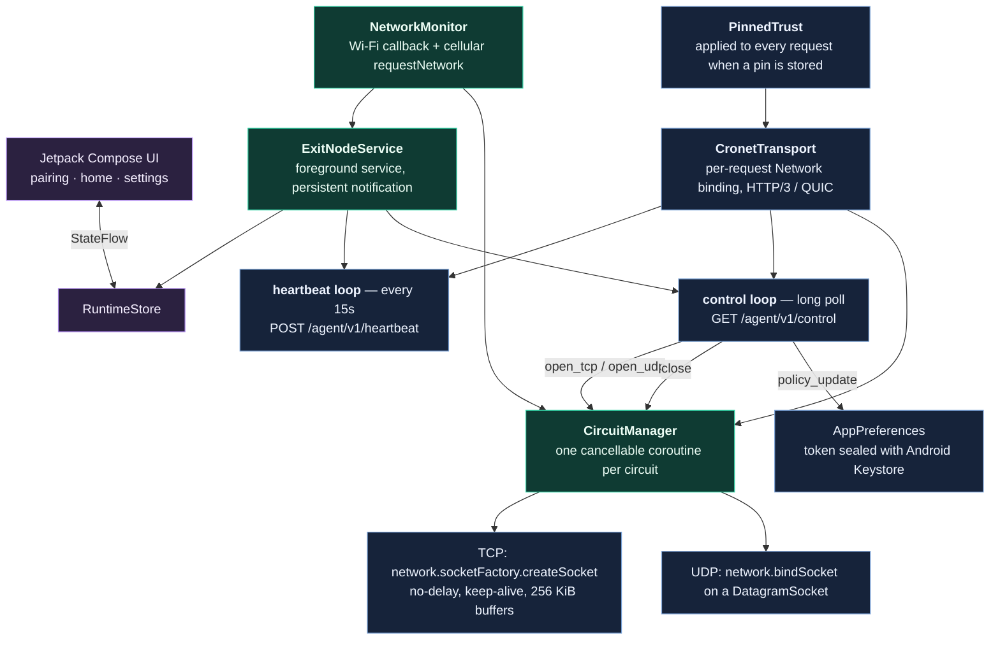

`NetworkMonitor` registers a Wi-Fi callback and requests a cellular `Network`.
Requesting cellular keeps it available while Wi-Fi remains Android's default
route; the process itself is never globally bound. Control requests are bound
per-request by Cronet to the selected `Network` handle. Destination traffic
resolves DNS and opens sockets on the selected exit `Network`.

Agent restarts are serialised, so two transports can never run at once. Circuit
coroutines always report a terminal status (`closed` or `failed`) on their way
out, even when cancelled, so the backend never keeps a phantom circuit open.

## The two independent planes

Most phone-proxy projects have one route. PocketExit has two, decided
separately, and re-decided per circuit.

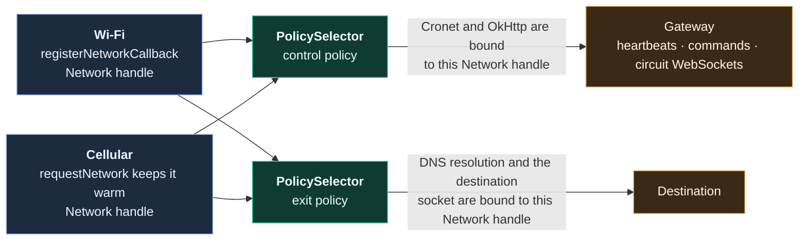

Typical operation:

```text
Android ↔ gateway control transport : Wi-Fi preferred
Android → destination socket        : cellular only
```

| Control | Exit | Result |
|---|---|---|
| Wi-Fi preferred | Cellular only | QUIC rides Wi-Fi when it exists; public egress always uses the SIM |
| Cellular only | Cellular only | Whole path on SIM data |
| Cellular preferred | Wi-Fi only | Control survives outside Wi-Fi; destinations require Wi-Fi |
| Automatic | Automatic | Wi-Fi first, cellular fallback, both planes |

If Wi-Fi vanishes, the control connection can reconnect over cellular while
destination sockets stay governed by their own exit policy. A circuit's control
and exit network are selected when it opens; if either disappears the circuit
closes and the control loop reconnects according to policy.

`PolicySelector` turns a policy plus live radio state into exactly one
`Network` handle, or `NONE`:

| Policy | Both validated | Only Wi-Fi | Only cellular | Neither |
|---|---|---|---|---|
| `AUTO` | Wi-Fi | Wi-Fi | cellular | **fail** |
| `WIFI_ONLY` | Wi-Fi | Wi-Fi | **fail** | **fail** |
| `CELLULAR_ONLY` | cellular | **fail** | cellular | **fail** |
| `WIFI_PREFERRED` | Wi-Fi | Wi-Fi | cellular | **fail** |
| `CELLULAR_PREFERRED` | cellular | Wi-Fi | cellular | **fail** |

`AUTO` and `WIFI_PREFERRED` are behaviourally identical today. **fail** means
`NetworkKind.NONE`: the circuit errors out. There is no implicit fallback
across a `_ONLY` boundary anywhere in the codebase — that is the whole point.

## Anatomy of one request

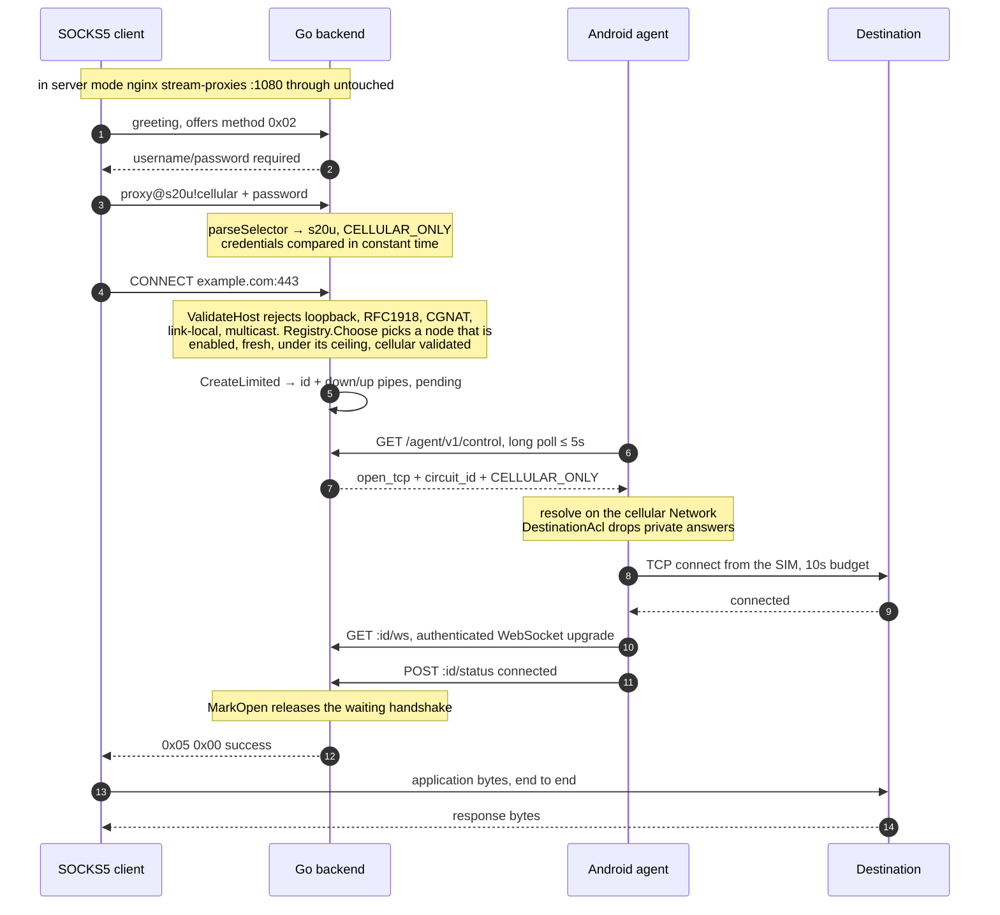

The SOCKS success reply is never optimistic. `handleTCP` blocks on
`circuit.WaitReady` until the phone has an established socket to the
destination and has said so. A phone that cannot honour the policy produces a
SOCKS error, not a silently rerouted connection.

## Choosing a phone

`nodes.Registry.Choose` runs on every CONNECT and on every new UDP target.

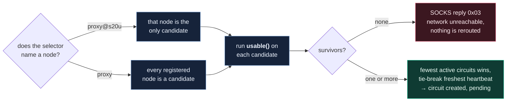

Every gate has to pass, and a failure is never rerouted onto another radio:

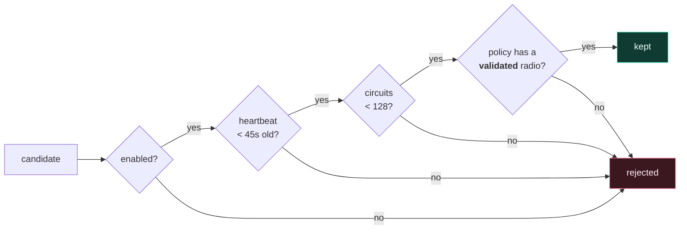

*Validated* is Android's own verdict (`NET_CAPABILITY_VALIDATED`): the radio is
attached **and** proved it reaches the Internet. A phone on a captive-portal
Wi-Fi is not selectable for a Wi-Fi policy.

| Requested policy | `usable()` requires |
|---|---|
| `WIFI_ONLY` | validated Wi-Fi |
| `CELLULAR_ONLY` | validated cellular |
| `AUTO`, `WIFI_PREFERRED`, `CELLULAR_PREFERRED` | at least one validated radio |

In personal mode the registry and the metrics only show phones that are still
paired: a node whose token has been revoked is filtered out even if a stale
heartbeat record survives.

## Resolving the exit policy

Three places can name a policy. This is the precedence chain:

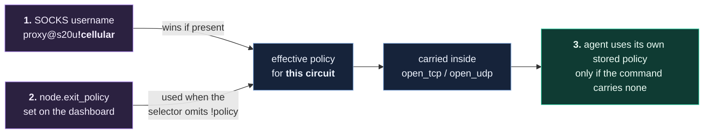

A policy `PATCH` from the dashboard is transactional: if the command queue for
that node is full, the dashboard state is rolled back rather than drifting from
the phone.

## Circuit lifecycle

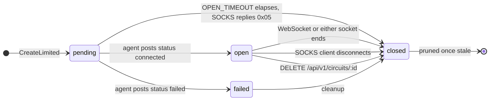

| Knob | Default | Bounds |
|---|---|---|
| heartbeat interval | 15 s | how fresh node telemetry stays (agent constant) |
| `NODE_OFFLINE_AFTER` | 45 s | heartbeat age past which a node stops being selectable |
| `COMMAND_WAIT` | 5 s | how long a control long poll blocks before returning `204` |
| `OPEN_TIMEOUT` | 45 s | how long the SOCKS handshake waits for the phone to confirm |
| TCP connect budget | 10 s | phone → destination |
| status post timeout | 15 s | agent → backend circuit status |
| control reconnect backoff | 1 s → 15 s | doubling, reset on any success |
| `IDLE_TIMEOUT` | 2 m | UDP association read deadline |
| `MAX_CIRCUITS_PER_NODE` | 128 | per-node ceiling, enforced in the registry **and** atomically in the circuit manager |
| `MAX_BYTES_PER_CIRCUIT` | 1 GiB | combined up/down transfer ceiling |

Closed circuit records are pruned once stale, on a one-minute sweep.

## TCP data path

A circuit is one authenticated binary WebSocket carrying a full-duplex byte
stream. TCP bytes pass through unchanged.

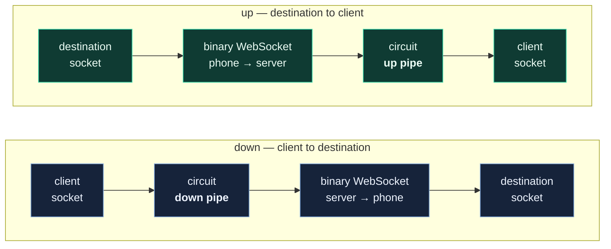

Why it is built this way:

- nginx upgrades `/agent/` WebSockets and disables buffering on the legacy
  stream endpoints, so a hosted connector can carry the upgraded connection
  without the v0.3.0 sustained-response cutoff.
- Each circuit gets its own WebSocket, so one stalled connection cannot
  head-of-line block another inside a shared multiplexing layer.
- Byte counters increment on the pipe writes and surface per circuit in
  `/api/v1/circuits` and on the dashboard. `/api/v1/metrics` exposes node and
  circuit *counts* rather than volumes.

## UDP data path

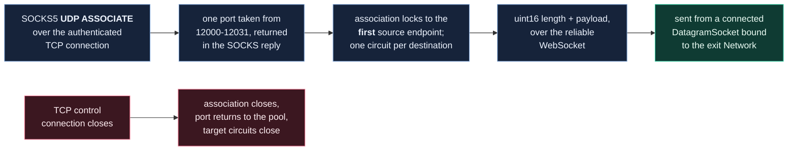

Datagram boundaries are preserved with a two-byte big-endian length prefix. The
frame layout is in [PROTOCOL.md](PROTOCOL.md). This deliberately rides a
**reliable WebSocket** — not QUIC DATAGRAM, not MASQUE CONNECT-UDP. Order and
delivery are preserved, which suits DNS and ordinary low-volume UDP, but
real-time media will feel head-of-line delay after packet loss.

## Where a destination gets blocked

The ACL is enforced twice, on purpose. The server check sees the *requested*
host; the phone check sees the *resolved* addresses. That second pass is what
stops a DNS answer from pointing at the phone's LAN or a metadata endpoint.

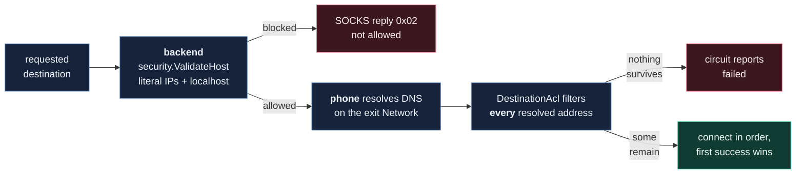

Ranges blocked when `ALLOW_PRIVATE_DESTINATIONS=false`, the default in both
modes:

```text
0.0.0.0/8         10.0.0.0/8        100.64.0.0/10     127.0.0.0/8
169.254.0.0/16    172.16.0.0/12     192.0.0.0/24      192.0.2.0/24
192.168.0.0/16    198.18.0.0/15     198.51.100.0/24   203.0.113.0/24
224.0.0.0/4       240.0.0.0/4
::/128            ::1/128           fc00::/7          fe80::/10
ff00::/8          2001:db8::/32
```

IPv4-mapped and IPv4-compatible IPv6 forms are normalised before matching, so
`::ffff:127.0.0.1` cannot slip past the IPv4 rules. `localhost` and
`*.localhost` are rejected by name.

## Who is allowed to do what

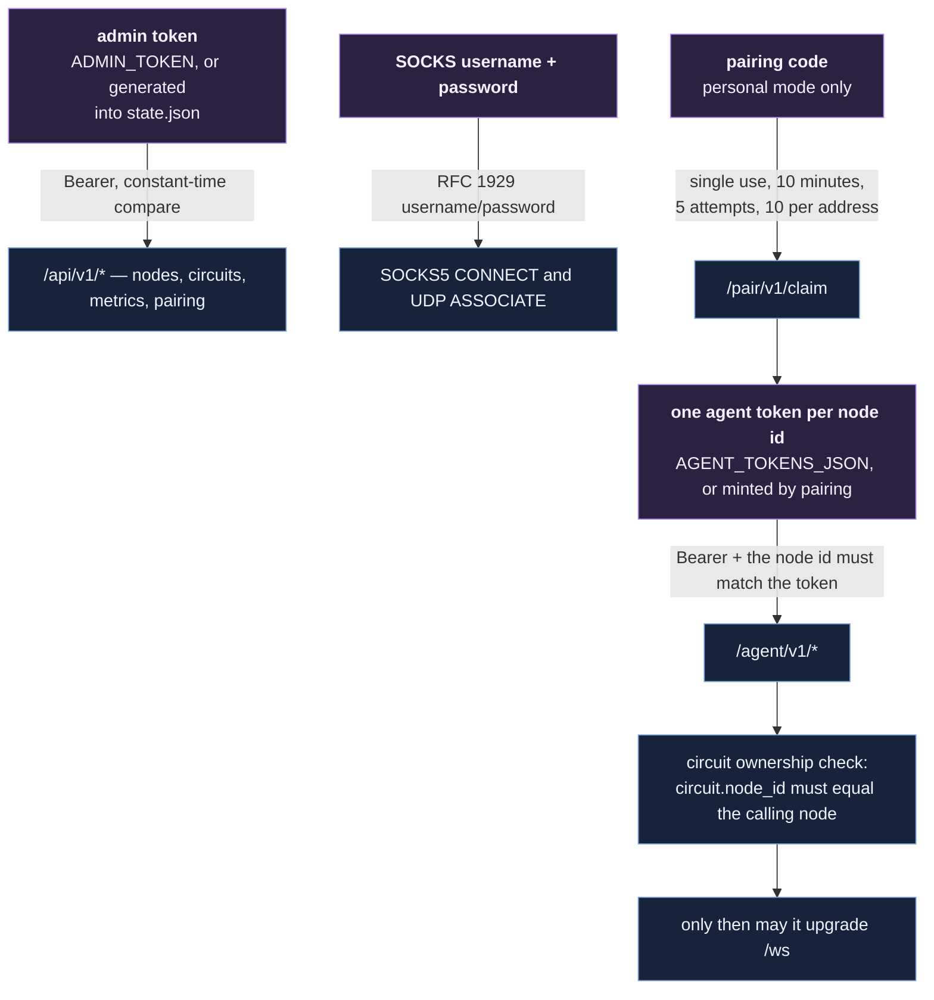

Token requirements are validated at boot in both modes: admin token 16–4096
bytes, SOCKS password 16–255 bytes, every agent token 16–4096 bytes, node ids
restricted to `[A-Za-z0-9._-]{1,64}`. The process refuses to start otherwise.

`/pair/v1/claim` is the only unauthenticated write endpoint in the system, it
exists only in personal mode, and its rate limiter reads the address from the
connection — never from `X-Forwarded-For`, which is attacker-controlled.

## Personal-mode state

`$POCKETEXIT_HOME`, defaulting to `~/.pocketexit`, created with mode `0700`.
The process refuses to start if the directory is readable by group or other.

| File | Mode | Contents |
|---|---|---|
| `tls.crt` | `0644` | Self-signed leaf certificate |
| `tls.key` | `0600` | ECDSA P-256 private key, PKCS#8 |
| `state.json` | `0600` | Admin token, SOCKS password, paired nodes |
| `audit.jsonl` | `0600` | Structured event log |

The certificate is regenerated when it is missing, expired, within 30 days of
expiry, or no longer covers the host's current addresses. The pin is over the
SubjectPublicKeyInfo rather than the whole certificate, so re-issuing for new
SANs with the same key does not invalidate already-paired phones. The full
contract — certificate parameters, pin construction, code alphabet, URI
grammar, claim semantics, threat model — is
[docs/pairing-protocol.md](docs/pairing-protocol.md).

## Failure handling

- Heartbeats run every 15 seconds.
- Control long polls return after 5 seconds by default, so hosted connectors
  deliver commands inside the circuit-open window.
- Missing networks produce a waiting state rather than route leakage.
- Circuit-open acknowledgement is required before SOCKS reports success.
- TCP destination connect timeout is 10 seconds; the backend open timeout is 45.
- WebSocket completion closes both directions.
- Stale closed circuit records are pruned.
- Agent restarts are serialised so two transports cannot run concurrently.
- A pin mismatch fails the TLS handshake with a `CertificateException` naming
  the expected and presented pins, so it is diagnosable rather than a bare
  "handshake failed".

## State and scale

Node, command, and circuit state is process-local and in memory. Structured
security events are persisted as JSON Lines — on the backend data volume in
server mode, in the state directory in personal mode. Paired node credentials
are the only durable control-plane state, and only in personal mode.

This is appropriate for one laptop and one phone, or one backend and a handful
of phones. Horizontal replication would require shared node presence, command
delivery, circuit ownership, and session affinity; those concerns are
deliberately out of scope.
