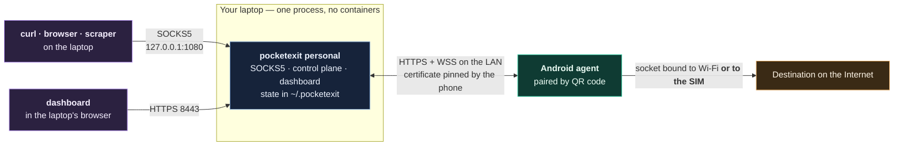
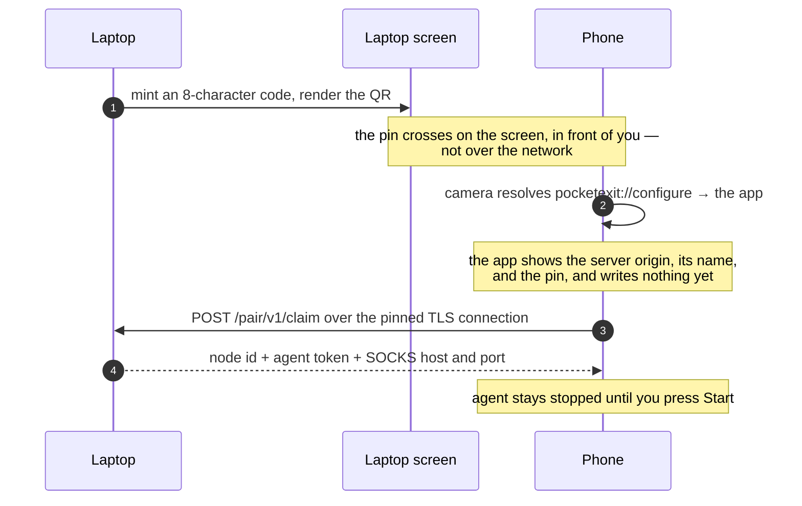
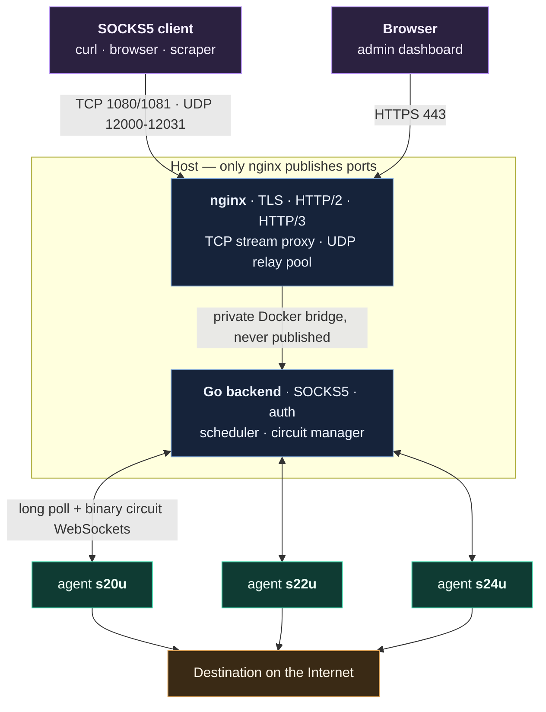
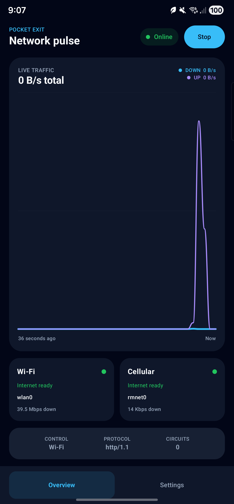
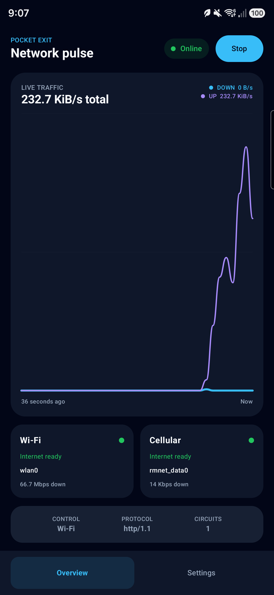

# PocketExit

**Turn an Android phone you own into a selectable Internet exit node.**

[](https://github.com/CesarPetrescu/PocketExit/actions/workflows/ci.yml)
[](https://github.com/CesarPetrescu/PocketExit/actions/workflows/codeql.yml)
[](LICENSE)

## What it is

PocketExit is a SOCKS5 proxy whose exit nodes are Android phones. You point a
browser, `curl`, or a scraper at the proxy; the selected phone opens the
destination through its Wi-Fi or its SIM and relays the bytes back. It is for
people who own the phones and the SIMs and want their own traffic to leave
through them — testing a service from a mobile network, reaching something that
only answers cellular clients, or just having an egress address that is not the
one their ISP hands out.

The phone needs no root, no `VpnService`, no ADB, no custom ROM, and no inbound
port. It only ever dials out.


<sup>The administration dashboard in server mode. Capture from a live v0.3.0
deployment; the admin token is masked and device addresses are omitted.</sup>

There are two ways to run it, and you only need to read one of them:

| | [Personal](#personal--one-laptop-one-phone) | [Server](#server--a-deployment-with-several-phones) |
|---|---|---|
| What you need | A laptop and a phone on the same network | A host with a public address and a DNS name |
| Setup | Run one binary, scan a QR code | Docker Compose, TLS certificate, hand-minted tokens |
| Certificate | Self-signed, pinned by the phone | Trusted by Android's system store |
| Who can use the proxy | The laptop, on `127.0.0.1:1080` | Anyone you give the credentials and the port to |
| Adding a phone | Scan a code | Edit `AGENT_TOKENS_JSON`, restart, type the token |

---

# Personal — one laptop, one phone

No domain, no certificate authority, no tokens to type. The binary runs on your
laptop, the phone pairs by camera, and the proxy listens on loopback.



## 1. Build and run the binary

Requires Go 1.23 or newer. There is no released backend binary yet, so build it.

```bash
git clone https://github.com/CesarPetrescu/PocketExit.git
cd PocketExit/backend
go build -o pocketexit ./cmd/server
./pocketexit personal --pair
```

That prints everything you need and then serves:

```text
PocketExit personal mode

  Dashboard       https://192.168.1.50:8443/
  Admin token     J4WsTXCmN7RvodBUjOaOtcfqR4dQ4IJolgo7D1LotW0
  SOCKS5 proxy    127.0.0.1:1080
  SOCKS username  proxy
  SOCKS password  bKdAs91INwt95TCDr7wrSUd97EgMmkyJFBeQf8EyddE
  Certificate pin 3aCuAD5-R6Hm9iPc-PsJyTW4h4ZLsjvI78yCc5qNs-Q
  Certificate     /home/you/.pocketexit/tls.crt
  State directory /home/you/.pocketexit
  Dashboard files /home/you/PocketExit/frontend

  Pairing code    B3NJ-B6GD  (expires 8:03PM)
  Scan this with the phone's camera app:

      … 29 rows of block characters forming a QR code …

  pocketexit://configure?fp=3aCuAD5-R6Hm9iPc-PsJyTW4h4ZLsjvI78yCc5qNs-Q&name=laptop&pair=B3NJB6GD&server=https%3A%2F%2F192.168.1.50%3A8443&v=2

time=2026-09-09T19:53:15.607Z level=INFO msg="issued a new certificate" …
time=2026-09-09T19:53:15.608Z level=INFO msg="HTTPS API listening" address=0.0.0.0:8443 server_url=https://192.168.1.50:8443
time=2026-09-09T19:53:15.608Z level=INFO msg="SOCKS5 proxy listening" address=127.0.0.1:1080 udp_port_start=12000 udp_port_end=12031
```

Every secret in that block is generated on first run, written to
`~/.pocketexit/state.json`, and reused on every later run.

On first start the process creates `~/.pocketexit` with mode `0700` and issues
a self-signed certificate covering `localhost`, the loopback addresses, and
every non-loopback address on the host. Nothing else is installed; the binary
serves the dashboard itself.

## 2. Install the app

Pairing is newer than the last tagged release, so build the APK. Docker is the
only thing you need installed:

```bash
make android-apk
# APK: android/app/build/outputs/apk/debug/app-debug.apk
```

The build container removes itself after the run. Copy the APK to the phone
however you like — USB, cloud storage, a browser download. No ADB.

**You do not need to install a certificate on the phone.** The agent
authenticates the laptop by the public-key pin carried in the QR code, which
bypasses the platform trust store, so a release build pairs with a self-signed
LAN certificate as-is.

## 3. Scan the code

Open the phone's ordinary camera app and point it at the QR in the terminal, or
at the one on the dashboard. There is no scanner inside the app and no camera
permission to grant.



The app shows what it is about to trust before anything is stored, so a
malicious `pocketexit://` link cannot silently repoint the agent. Confirm, then
press **Start** on the phone. It appears in the dashboard's fleet list within a
heartbeat.

The code lasts 10 minutes, pairs one phone, and is destroyed the moment it is
used. Mint another from the dashboard for the next phone, or restart with
`--pair`.

## 4. Send traffic through it

Use the SOCKS username and password from the startup block:

```bash
curl --proxy socks5h://127.0.0.1:1080 \
     --proxy-user 'proxy:bKdAs91INwt95TCDr7wrSUd97EgMmkyJFBeQf8EyddE' \
     https://api.ipify.org
# → the public address of the phone, not the laptop's
```

Force this one request onto the SIM even though the phone is on Wi-Fi:

```bash
curl --proxy socks5h://127.0.0.1:1080 \
     --proxy-user 'proxy!cellular:bKdAs91INwt95TCDr7wrSUd97EgMmkyJFBeQf8EyddE' \
     https://api.ipify.org
```

See [Picking a phone and a radio](#picking-a-phone-and-a-radio) for the full
selector grammar. Before a phone has paired and started, a CONNECT is refused
rather than routed anywhere else:

```text
curl: (97) Can't complete SOCKS5 connection to api.ipify.org. (3)
```

## The dashboard

Open the URL from the startup block and paste the admin token. Your browser
will warn about the self-signed certificate; that is expected, and it is why
the phone pins the key instead of trusting a chain. From there you can mint and
cancel pairing codes, watch live circuits and byte counters, change each
phone's control and exit policy, disable a phone, and unpair one (which revokes
its token and closes its circuits).

For scripts, the same certificate works with `curl`:

```bash
curl --cacert ~/.pocketexit/tls.crt https://127.0.0.1:8443/api/v1/health
# {"status":"ok","time":"2026-09-09T19:50:09.855349171Z"}
```

## Flags and defaults

```text
pocketexit personal [flags]

  -dir string          state directory (default $POCKETEXIT_HOME, else ~/.pocketexit)
  -frontend string     dashboard directory to serve (default the bundled frontend)
  -https-addr string   HTTPS listener address (default "0.0.0.0:8443")
  -pair                mint a pairing code at startup and print its QR code
  -socks-addr string   SOCKS5 listener address (default "127.0.0.1:1080")
```

| | Personal | Server |
|---|---|---|
| HTTPS listener | `0.0.0.0:8443`, direct TLS, no nginx | `:8080` behind nginx |
| SOCKS listener | `127.0.0.1:1080` — loopback only | `:1080`, published |
| UDP relay | `127.0.0.1:12000-12031` | `0.0.0.0:12000-12031` |
| Admin token | generated into `state.json` | `ADMIN_TOKEN` |
| Agent tokens | minted by pairing | `AGENT_TOKENS_JSON` |
| Audit log | `~/.pocketexit/audit.jsonl` | `AUDIT_LOG_PATH` |

SOCKS binds to loopback because the laptop is the only client. `--socks-addr`
can move it, and the process logs a warning when the address is not loopback —
publishing it puts an authenticated open proxy on your LAN.

`~/.pocketexit` holds the TLS private key (`0600`), and `state.json` (`0600`)
holds the admin token, the SOCKS password, and every paired phone's agent
token. Back it up like a password file or not at all.

## When the phone cannot reach the laptop

The address in the QR is the first non-loopback address on the host, which is
wrong on a multi-homed machine. Pin the interface instead:

```bash
./pocketexit personal --pair --https-addr 192.168.1.50:8443
```

Otherwise: the laptop's firewall has to allow inbound TCP 8443, and the access
point must not have client isolation turned on.

---

# Server — a deployment with several phones

The deployed path: nginx terminates TLS with a certificate Android already
trusts, stream-proxies SOCKS, and the Go backend runs behind it on a private
Compose network. Each phone gets a token you mint by hand in
`AGENT_TOKENS_JSON`.



## Prerequisites

- Docker Engine with the Compose plugin, and OpenSSL
- A DNS name pointing at the host
- TCP 80, TCP/UDP 443, TCP 1080 or TLS/TCP 1081, and optional UDP 12000–12031

## 1. Bring up the gateway

```bash
git clone https://github.com/CesarPetrescu/PocketExit.git
cd PocketExit
DOMAIN=proxy.example.com make setup   # writes .env (mode 600) + development certificates
$EDITOR .env                          # review the generated credentials
docker compose up --build -d
```

Validate:

```bash
curl -k https://127.0.0.1/api/v1/health
docker compose exec nginx nginx -t
docker compose ps
```

`-k` exists only for the generated development certificate. It is not a
production trust strategy.

<details>
<summary>Production TLS</summary>

Replace `nginx/certs/server.crt` and `nginx/certs/server.key` with a
certificate and key trusted by Android's system trust store. The nginx
container deliberately does not automate ACME issuance, so renewal can be wired
into whatever certificate workflow the host already runs without changing
PocketExit. The release build trusts system CAs only; the debug build also
accepts user-installed CAs for local testing.

</details>

<details>
<summary>Optional: PhotonSpark-hosted HTTP endpoint, with no inbound firewall rule</summary>

Add the one-time connector token to `.env` as `SPARK_TUNNEL_TOKEN`, then:

```bash
docker compose --profile tunnel -f docker-compose.yml -f docker-compose.tunnel.yml up --build -d
```

SparkTunnel carries the dashboard, API, agent control, and circuit WebSockets.
It does **not** publish raw SOCKS5 TCP or the UDP relay ports, so clients still
need direct or VPN access to 1080/1081 and 12000–12031.

</details>

## 2. Configure each phone

`make setup` writes `AGENT_TOKENS_JSON={"s20u":"…","s22u":"…","s24u":"…"}` into
`.env`. Install the APK — either the signed one from the
[latest release](https://github.com/CesarPetrescu/PocketExit/releases/latest)
or a debug build from `make android-apk` — then on each phone open
**Settings → Manual setup** and enter:

| Field | Example |
|---|---|
| Backend URL | `https://proxy.example.com` |
| Node ID | `s20u`, `s22u`, or `s24u` |
| Agent token | the matching value from `AGENT_TOKENS_JSON` |
| Control tunnel | Wi-Fi preferred |
| Proxy exit | Cellular only, or Cellular preferred |

Or skip the typing: once a node has sent one heartbeat, the dashboard's **Pair phone**
action on that node renders a `v=1` onboarding QR. Scan it with the phone's
camera and confirm in the app. That QR contains the node's bearer token — do
not share or keep screenshots of it.

With development certificates, also install `nginx/certs/ca.crt` as a user CA
and use only the debug APK with it.

## 3. Send traffic through it

Use `SOCKS_USERNAME` and `SOCKS_PASSWORD` from `.env`:

```bash
curl --proxy socks5h://proxy.example.com:1080 \
     --proxy-user 'proxy@s20u!cellular:PASSWORD' \
     https://api.ipify.org
# → the public IPv4 of the SIM in the phone named s20u
```

> [!WARNING]
> `:1080` is plain SOCKS5 over raw TCP. Restrict it to trusted sources or a
> VPN. Port `1081` wraps the same session in TLS for clients using `stunnel`,
> `gost`, or another local TLS wrapper; `curl --proxy socks5h://…` does not add
> that outer layer by itself. HTTPS destinations keep their own end-to-end TLS
> either way, but the SOCKS credentials are exposed to the network path.

## Ports

| Port | Transport | Published | Purpose |
|---|---|---|---|
| `80` | TCP | yes | 308 redirect to HTTPS |
| `443` | TCP | yes | Dashboard, `/api/`, `/agent/` over TLS + HTTP/2 |
| `443` | UDP | yes | The same, over HTTP/3 / QUIC |
| `1080` | TCP | yes | Authenticated SOCKS5 (nginx `stream` → backend) |
| `1081` | TLS/TCP | yes | TLS-wrapped SOCKS5 |
| `12000–12031` | UDP | yes | SOCKS5 UDP relay pool, one port per association |
| `8080` | TCP | **no** | Go HTTP API, internal bridge only |
| `8081` | TCP | **no** | Plain-HTTP origin for the optional SparkTunnel connector |

## Configuration

Server mode is environment-driven, read once at boot, and validated before the
listeners open. The process refuses to start on a bad value.

<details>
<summary>Every variable</summary>

| Variable | Default | Purpose |
|---|---|---|
| `PUBLIC_PROXY_HOST` | `127.0.0.1` | Host clients see in UDP ASSOCIATE replies. DNS name or IP, no port |
| `ADMIN_TOKEN` | — | Dashboard and `/api/v1/*` bearer token. 16–4096 bytes |
| `SOCKS_USERNAME` | `proxy` | Base username before any `@node!policy` selector |
| `SOCKS_PASSWORD` | — | SOCKS5 password. 16–255 bytes |
| `AGENT_TOKENS_JSON` | — | **Required.** `{"node_id":"token"}`, one per phone |
| `HTTP_ADDR` | `:8080` | Internal API listener |
| `SOCKS_ADDR` | `:1080` | SOCKS5 listener |
| `UDP_BIND_HOST` | `0.0.0.0` | Bind address for relay ports |
| `UDP_PORT_START` / `UDP_PORT_END` | `12000` / `12031` | Relay pool, max span 1024 |
| `NODE_OFFLINE_AFTER` | `45s` | Heartbeat age that marks a node offline |
| `COMMAND_WAIT` | `5s` | Control long-poll duration before `204` |
| `OPEN_TIMEOUT` | `45s` | Wait for the phone to confirm a circuit |
| `IDLE_TIMEOUT` | `2m` | UDP association idle deadline |
| `MAX_CIRCUITS_PER_NODE` | `128` | Per-node concurrent circuit ceiling |
| `MAX_BYTES_PER_CIRCUIT` | `1073741824` | Combined transfer ceiling per circuit, minimum 1 MiB |
| `ALLOW_PRIVATE_DESTINATIONS` | `false` | Keep `false` for an Internet exit pool |
| `LOG_JSON` | `true` | JSON handler when `true`, plain text when `false` |
| `LOG_LEVEL` | `info` | Set to `debug` for verbose handler logs |
| `AUDIT_LOG_PATH` | `/data/audit.jsonl` | Structured JSONL log on the persistent volume |
| `SPARK_TUNNEL_TOKEN` | — | Only for the optional `tunnel` Compose profile |

</details>

---

# Picking a phone and a radio

Both modes share one control surface: the SOCKS5 username.

```text
proxy @ s24u ! cellular
  │      │        │
  │      │        └── exit policy, this circuit only
  │      └─────────── which phone must serve it
  └────────────────── the base username
```

All four forms are valid: `proxy`, `proxy@NODE_ID`, `proxy!POLICY`,
`proxy@NODE_ID!POLICY`. With no node named, the least-loaded eligible phone
serves the request.

| Alias | Resolves to |
|---|---|
| `auto` | `AUTO` |
| `wifi`, `wifi_only` | `WIFI_ONLY` |
| `cell`, `cellular`, `lte`, `5g`, `cellular_only` | `CELLULAR_ONLY` |
| `wifi_preferred` | `WIFI_PREFERRED` |
| `cellular_preferred`, `cell_preferred` | `CELLULAR_PREFERRED` |

`5g` is only an alias for `CELLULAR_ONLY`. Android can request the cellular
transport but cannot pin the modem to NR, and the carrier may serve LTE.

A `_ONLY` policy that cannot be satisfied **fails the circuit**. There is no
implicit fallback across that boundary anywhere in the codebase, so a request
you forced onto the SIM never quietly leaves over Wi-Fi. A phone whose radio is
attached but has not passed Android's own `NET_CAPABILITY_VALIDATED` check — a
captive portal, say — is not selectable for that policy.

A client implementing UDP ASSOCIATE gets one authenticated relay port from the
pool per association.

---

# What this is not

- **Not a VPN.** Nothing is routed automatically. Only the applications you
  point at the SOCKS proxy use it, and an application that ignores proxy
  settings will ignore this one.
- **It does not hide your traffic from the carrier.** The last hop leaves the
  phone's SIM in the clear beyond whatever end-to-end encryption the client
  already had. The carrier sees the destinations.
- **It is not anonymity.** The exit address belongs to a SIM registered to you.
  A destination sees a mobile IP, and your carrier can connect it back.
- **Exit bandwidth is one phone's uplink**, shared by every circuit on that
  phone, and metered by whatever plan the SIM is on.
- **A compromised laptop holds everything.** In personal mode `~/.pocketexit`
  contains the TLS private key, the admin token, the SOCKS password, and every
  paired phone's agent token. There is no second factor.
- **Anyone who can see the screen during pairing can pair a phone.** The window
  is 10 minutes and the code is single-use, but that is the whole defence.
- **State is in memory.** Restarting the backend clears node records and
  circuit history. Phones re-register on their next heartbeat; in personal mode
  their tokens survive in `state.json`, and any outstanding pairing code does
  not.
- **Circuits do not survive a control-network change.** They close; the agent
  reconnects and accepts new ones.
- **UDP is length-framed over a reliable WebSocket**, not QUIC DATAGRAM or
  MASQUE. Order and delivery hold, but loss adds head-of-line latency, so
  real-time media will feel it.
- **The UDP relay pool has a first-packet race.** A port is created only after
  an authenticated `UDP ASSOCIATE` and locks to the first source endpoint it
  sees, but the range is fixed. Firewall it, or do not publish it.
- **OEM battery management can still kill the foreground service.** Exempting
  the app from battery optimisation is a manual step in device settings.
- **HTTP/3 is opportunistic.** A path blocking UDP 443 falls back to HTTPS over
  TCP. Watch `transport_protocol` in the telemetry if that matters.
- **Not implemented:** multi-user tenancy, billing, tamper-evident audit
  signing, mTLS, automatic certificate issuance, horizontal replication.
- **Legal:** carrier terms and local law may restrict proxying or sustained
  tethering-like traffic. Use only devices, SIMs, accounts, and services you own
  and are authorised to operate.

Read [SECURITY.md](SECURITY.md) before exposing any of this to the Internet.

---

# How it works

Two routes are decided separately and re-decided per circuit: the *control*
route carrying heartbeats, commands, and circuit WebSockets, and the *exit*
route carrying DNS and the destination socket. `NetworkMonitor` keeps both
radios alive at once — `requestNetwork` on cellular holds a usable `Network`
handle while Android keeps Wi-Fi as the system default — so the process is
never globally bound and one phone can carry control over Wi-Fi while its
traffic leaves over the SIM.

Every proxied connection is one circuit with its own id, its own pair of
in-memory pipes, and its own authenticated binary WebSocket. The SOCKS success
reply is never optimistic: the handshake blocks until the phone reports an
established socket to the destination.

| Document | What is in it |
|---|---|
| [ARCHITECTURE.md](ARCHITECTURE.md) | Components, the two planes, circuit lifecycle, both data paths, where a destination gets blocked, timing constants |
| [PROTOCOL.md](PROTOCOL.md) | Wire formats: agent endpoints, admin endpoints, pairing, the circuit WebSocket |
| [docs/pairing-protocol.md](docs/pairing-protocol.md) | The binding personal-mode contract: certificate, pin, code, URI, claim, threat model |
| [SECURITY.md](SECURITY.md) | Threat model and deployment checklist |
| [TEST-REPORT.md](TEST-REPORT.md) | What has been verified, and when |

## What the phone looks like

<details>
<summary>App screenshots, PocketExit v0.3.0</summary>

These captures predate the pairing rebuild: they show the v0.3.0 overview
surface relaying real traffic, not the current pairing-first UI. Android System
UI demo mode suppressed personal notification details during capture.

| Galaxy S22 Ultra | Galaxy S24 Ultra |
|---|---|
|  |  |

</details>

<details>
<summary>Dashboard, mobile layout</summary>


</details>

---

# Repository layout

```text
android/              Gradle project (Kotlin, Compose, Cronet, OkHttp)
  …/network/          NetworkMonitor · transports · PolicySelector · PinnedTrust · PairingClient
  …/proxy/            CircuitManager · DatagramCodec
  …/service/          ExitNodeService foreground service · BootReceiver
  …/ui/               Pairing screens and sheets, home, settings
backend/              Go control plane and SOCKS5 proxy
  cmd/server/         Entry point: a bare run is server mode, "personal" is the other
  internal/personal/  State directory, certificate and pin, pairing codes, minted tokens
  internal/proxy/     SOCKS5 CONNECT + UDP ASSOCIATE, selector parsing
  internal/nodes/     Registry, command queues, scheduler
  internal/circuit/   Circuit pipes, state, per-node ceiling, pruning
  internal/security/  Destination ACL
  internal/httpapi/   Admin, agent, and pairing HTTP surface
frontend/             Static dependency-free dashboard, served by nginx or by the binary
nginx/                Image, configuration, local certificates
scripts/              Setup, validation, smoke-test, packaging
.github/e2e/          Process-level end-to-end tests CI runs on every push
docs/images/          Redacted live captures
docker-compose.yml    Complete server deployment
```

# Tests

```bash
make test          # Go unit + race + coverage, backend smoke, frontend syntax, YAML/XML/shell checks
make test-android  # Gradle unit tests, lint, debug APK
make test-docker   # Compose build, startup, health check, nginx -t
make test-live     # Real HTTP/HTTPS/download/Git/WSS/security checks through every phone
```

The two process-level end-to-end tests can also be run directly:

```bash
./.github/e2e/personal-smoke.sh    # pair a simulated phone over a self-signed certificate, then unpair it
python3 .github/e2e/socks-e2e.py   # drive TCP and UDP through the proxy with a simulated phone
```

CI runs the Go, smoke, end-to-end, Android, and Compose jobs on every push and
pull request, holds Go coverage above a floor, and uploads the debug APK as a
build artifact. `test-live` is intentionally manual: it needs the ignored
`.env`, a running deployment, and online physical phones, and it never prints
proxy credentials or the cellular addresses it validates.

Tag pushes run the release workflow, which checks the tag against `versionName`
in `android/app/build.gradle.kts`, publishes a signed checksummed APK, and
pushes backend, nginx, and Android-builder images to GHCR. It needs the four
repository secrets `ANDROID_KEYSTORE_BASE64`, `ANDROID_KEYSTORE_PASSWORD`,
`ANDROID_KEY_ALIAS`, and `ANDROID_KEY_PASSWORD`. Back up the signing keystore:
losing it prevents future updates from installing over a released APK.

# License

Copyright © 2026 Cesar Petrescu.

PocketExit is free software licensed under the
[GNU Affero General Public License v3.0 or later](LICENSE). Redistributed
versions must keep the copyright and license notices, and modified versions
offered to users over a network must offer their corresponding source code. See
[NOTICE](NOTICE).
