<div align="center">

# PocketExit

**Turn Android phones you own into selectable, private Internet exit nodes.**

One authenticated SOCKS5 gateway. Pick a phone, pick a radio, and the traffic
leaves through that SIM — no root, no `VpnService`, no ADB, no custom ROM.

[](https://github.com/CesarPetrescu/PocketExit/actions/workflows/ci.yml)
[](https://github.com/CesarPetrescu/PocketExit/releases/latest)
[](LICENSE)
[](backend/go.mod)
[](android/app/build.gradle.kts)

[Download the APK](https://github.com/CesarPetrescu/PocketExit/releases/latest) ·
[Live dashboard](https://exit.photonspark.ro) ·
[Architecture](ARCHITECTURE.md) ·
[Protocol](PROTOCOL.md) ·
[Security](SECURITY.md)

</div>

```bash
curl --proxy socks5h://proxy.example.com:1080 \
     --proxy-user 'proxy@s20u!cellular:PASSWORD' \
     https://api.ipify.org
# → the public IPv4 of the SIM in the phone named s20u
```

> [!IMPORTANT]
> The v0.2.0 APK is debug-signed. SparkTunnel 0.3.0 carries the dashboard, API,
> heartbeats, and short requests fine, but its HTTP path cuts sustained circuit
> streams after roughly 16–17 seconds. Use direct Nginx ingress for normal
> SOCKS5 traffic.

---

## Contents

| | |
|---|---|
| **Understand it** | [What it does](#what-it-does) · [System on one page](#the-system-on-one-page) · [Two independent planes](#the-one-idea-that-matters-two-independent-planes) · [Anatomy of one request](#anatomy-of-one-request) |
| **The logic** | [Choosing a phone](#1-choosing-a-phone) · [Resolving the policy](#2-resolving-the-exit-policy) · [Circuit lifecycle](#3-circuit-lifecycle) · [Moving bytes](#4-how-the-bytes-actually-move) · [UDP](#5-the-udp-path) · [Blocking destinations](#6-where-a-destination-gets-blocked) · [Authentication](#7-who-is-allowed-to-do-what) · [Inside the agent](#8-inside-the-android-agent) |
| **Run it** | [Quick start](#quick-start) · [Configuration](#configuration) · [API](#api-surface) · [Tests](#tests) |
| **Know the edges** | [Real-hardware evidence](#verified-on-real-hardware) · [Limits](#limits-stated-plainly) · [Security](SECURITY.md) |

---

## What it does

- **Selectable egress.** A client picks *which phone* and *which radio* serves a
  connection, per request, using only the SOCKS5 username field.
- **Real cellular egress.** The destination socket is bound to the phone's
  cellular `Network` handle, so the traffic exits through the SIM even while
  Wi-Fi stays the phone's default route.
- **No inbound listener on a phone.** Phones only ever dial out. Everything
  arrives over an authenticated long poll from the gateway.

The Android side uses ordinary public APIs only — no root, no ADB dependency, no
`VpnService`, no process-wide route changes, no device-owner mode.

---

## The system on one page

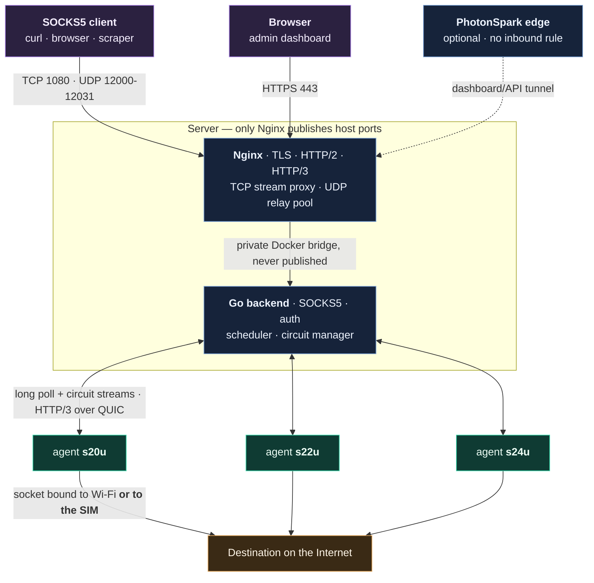

Every public port lands on Nginx. The Go process is reachable only on the
internal Compose network.

| Port | Transport | Exposed | Purpose |
|---|---|---|---|
| `80` | TCP | yes | 308 redirect to HTTPS |
| `443` | TCP | yes | Dashboard, `/api/`, `/agent/` over TLS + HTTP/2 |
| `443` | UDP | yes | The same, over HTTP/3 / QUIC |
| `1080` | TCP | yes | Authenticated SOCKS5 (Nginx `stream` → backend) |
| `12000–12031` | UDP | yes | SOCKS5 UDP relay pool, one port per association |
| `8080` | TCP | **no** | Go HTTP API, internal bridge only |
| `8081` | TCP | **no** | Plain-HTTP origin for the optional SparkTunnel connector |

---

## The one idea that matters: two independent planes

Most phone-proxy projects have one route. PocketExit has two, decided
separately, and re-decided per circuit.

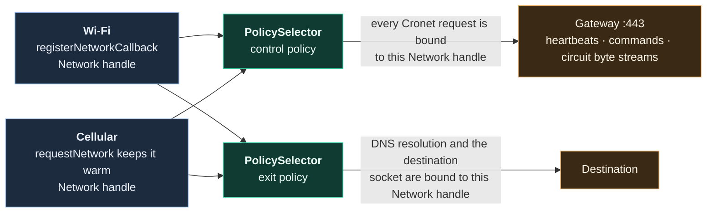

`NetworkMonitor` holds both radios alive at once. `requestNetwork` on cellular
keeps a usable cellular `Network` object available while Android keeps Wi-Fi as
the system default route — the process itself is never globally bound.

Typical operation:

```text
Android ↔ gateway control transport : Wi-Fi preferred
Android → destination socket        : cellular only
```

| Control | Exit | Result |
|---|---|---|
| Wi-Fi preferred | Cellular only | QUIC rides Wi-Fi when it exists; public egress always uses the SIM |
| Cellular only | Cellular only | Whole path on SIM data |
| Cellular preferred | Wi-Fi only | Control survives outside Wi-Fi; destinations require Wi-Fi |
| Automatic | Automatic | Wi-Fi first, cellular fallback, both planes |

If Wi-Fi vanishes, the control connection can reconnect over cellular while
destination sockets stay governed by their own exit policy. `CELLULAR_ONLY`
**fails the circuit** rather than quietly leaking it through Wi-Fi.

---

## Anatomy of one request

What actually happens between `curl` and the destination, in order:

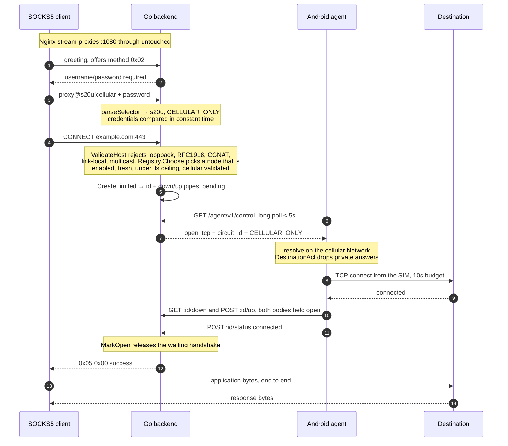

> [!NOTE]
> The SOCKS success reply is never optimistic. `handleTCP` blocks on
> `circuit.WaitReady` until the phone has an established socket to the
> destination and has said so. A phone that cannot honour the policy produces a
> SOCKS error, not a silently rerouted connection.

---

# The logic

## 1. Choosing a phone

`nodes.Registry.Choose` runs on every CONNECT and on every new UDP target.

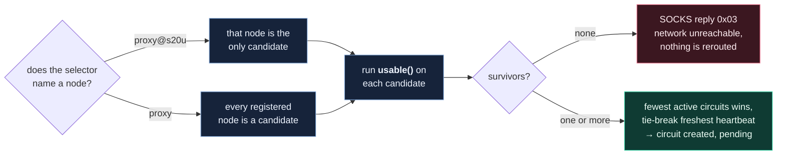

Every gate has to pass, and a failure is never rerouted onto another radio:

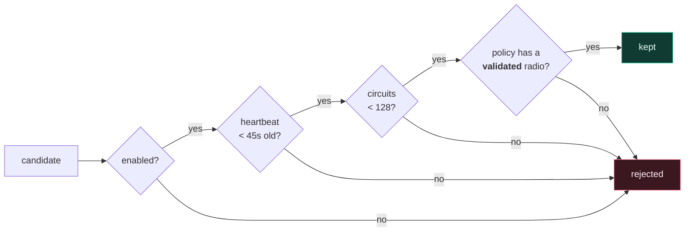

*Validated* is Android's own verdict (`NET_CAPABILITY_VALIDATED`) — the radio is
attached **and** proved it reaches the Internet. A phone on a captive-portal
Wi-Fi is not selectable for a Wi-Fi policy.

Which radio each policy demands:

| Requested policy | `usable()` requires |
|---|---|
| `WIFI_ONLY` | validated Wi-Fi |
| `CELLULAR_ONLY` | validated cellular |
| `AUTO`, `WIFI_PREFERRED`, `CELLULAR_PREFERRED` | at least one validated radio |

## 2. Resolving the exit policy

Three places can name a policy. This is the precedence chain:

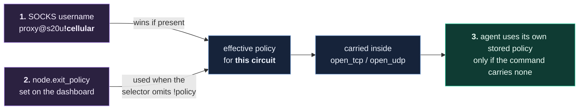

`PolicySelector` on the phone then turns a policy plus live radio state into
exactly one `Network` handle, or `NONE`:

| Policy | Both validated | Only Wi-Fi | Only cellular | Neither |
|---|---|---|---|---|
| `AUTO` | Wi-Fi | Wi-Fi | cellular | **fail** |
| `WIFI_ONLY` | Wi-Fi | Wi-Fi | **fail** | **fail** |
| `CELLULAR_ONLY` | cellular | **fail** | cellular | **fail** |
| `WIFI_PREFERRED` | Wi-Fi | Wi-Fi | cellular | **fail** |
| `CELLULAR_PREFERRED` | cellular | Wi-Fi | cellular | **fail** |

`AUTO` and `WIFI_PREFERRED` are behaviourally identical today. **fail** means
`NetworkKind.NONE`: the circuit errors out. There is no implicit fallback across
a `_ONLY` boundary anywhere in the codebase — that is the whole point.

## 3. Circuit lifecycle

Every proxied connection is one circuit, with its own id and its own pair of
in-memory pipes.

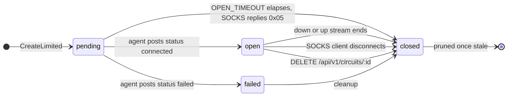

Timing that governs those transitions:

| Knob | Default | Bounds |
|---|---|---|
| heartbeat interval | 15 s | how fresh node telemetry stays (agent constant) |
| `NODE_OFFLINE_AFTER` | 45 s | heartbeat age past which a node stops being selectable |
| `COMMAND_WAIT` | 5 s | how long a control long poll blocks before returning `204` |
| `OPEN_TIMEOUT` | 45 s | how long the SOCKS handshake waits for the phone to confirm |
| TCP connect budget | 10 s | phone → destination |
| status post timeout | 15 s | agent → backend circuit status |
| control reconnect backoff | 1 s → 15 s | doubling, reset on any success |
| `IDLE_TIMEOUT` | 2 m | UDP association read deadline |
| `MAX_CIRCUITS_PER_NODE` | 128 | per-node ceiling, enforced in the registry **and** atomically in the circuit manager |

## 4. How the bytes actually move

A circuit is two independent HTTP streams in opposite directions, not one
multiplexed tunnel.

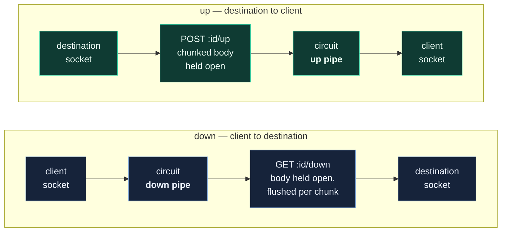

Why it is built this way:

- **Nginx buffering is off under `/agent/`** in both directions, so nothing
  accumulates on disk or in RAM and latency stays low.
- **HTTP/3 terminates at Nginx**, which forwards the private hop to Go over
  plain HTTP/1.1. QUIC's loss recovery covers the lossy mobile segment; the Go
  service stays dependency-free.
- Each circuit gets its own pair of streams, so one stalled connection cannot
  head-of-line block another inside a shared custom framing layer.
- Byte counters increment on those pipe writes and surface per circuit in
  `/api/v1/circuits` and on the dashboard. `/api/v1/metrics` exposes node and
  circuit *counts* rather than volumes.

## 5. The UDP path

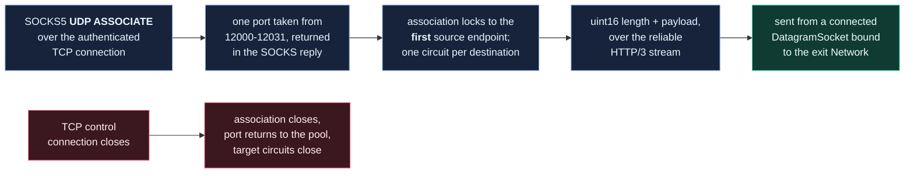

Datagram boundaries are preserved with a two-byte big-endian length prefix:

```text
 0                   1                   2
 0 1 2 3 4 5 6 7 8 9 0 1 2 3 4 5
+-------------------------------+
|        payload length         |  uint16, network byte order, max 65507
+-------------------------------+
|        datagram payload ...   |
+-------------------------------+
```

This deliberately rides **reliable** HTTP/3 streams — not QUIC DATAGRAM, not
MASQUE CONNECT-UDP. Order and delivery are preserved, which suits DNS and
ordinary low-volume UDP, but real-time media will feel head-of-line delay after
packet loss.

## 6. Where a destination gets blocked

The ACL is enforced twice, on purpose. The server check sees the *requested*
host; the phone check sees the *resolved* addresses. That second pass is what
stops a DNS answer from pointing at the phone's LAN or a metadata endpoint.

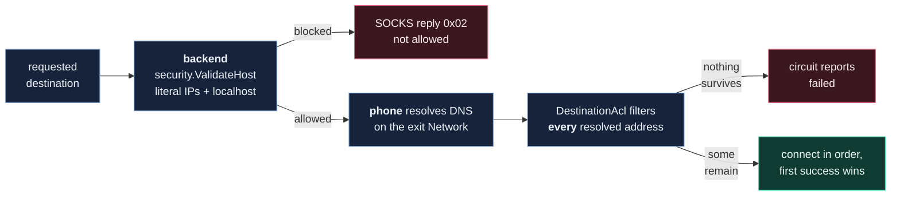

<details>
<summary>Ranges blocked when <code>ALLOW_PRIVATE_DESTINATIONS=false</code> (the default)</summary>

```text
0.0.0.0/8         10.0.0.0/8        100.64.0.0/10     127.0.0.0/8
169.254.0.0/16    172.16.0.0/12     192.0.0.0/24      192.0.2.0/24
192.168.0.0/16    198.18.0.0/15     198.51.100.0/24   203.0.113.0/24
224.0.0.0/4       240.0.0.0/4
::/128            ::1/128           fc00::/7          fe80::/10
ff00::/8          2001:db8::/32
```

IPv4-mapped and IPv4-compatible IPv6 forms are normalised before matching, so
`::ffff:127.0.0.1` cannot slip past the IPv4 rules. `localhost` and
`*.localhost` are rejected by name.

</details>

## 7. Who is allowed to do what

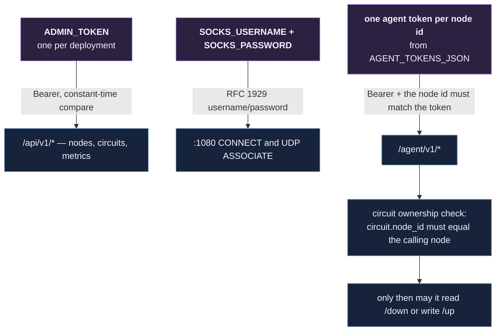

Token requirements are validated at boot: `ADMIN_TOKEN` 16–4096 bytes,
`SOCKS_PASSWORD` 16–255 bytes, every agent token 16–4096 bytes, node ids
restricted to `[A-Za-z0-9._-]{1,64}`. The process refuses to start otherwise.

## 8. Inside the Android agent

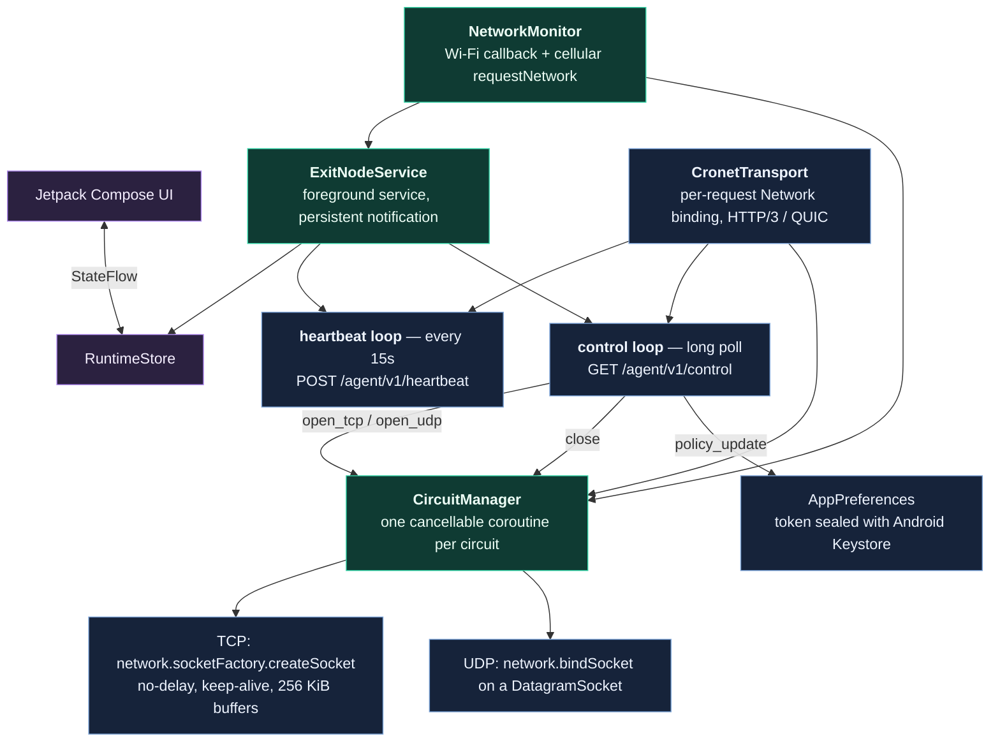

Agent restarts are serialised, so two transports can never run at once. Circuit
coroutines always report a terminal status (`closed` or `failed`) on their way
out, even when cancelled, so the backend never keeps a phantom circuit open.

---

## Verified on real hardware

On 2026-08-10 a USB-debugged Samsung **SM-G988B** (Galaxy S20 Ultra, node
`s20u`) ran the agent against the live deployment. Wi-Fi (`wlan0`) carried
control traffic; cellular (`rmnet1`) was independently validated for exit
traffic.

```bash
curl --proxy socks5h://proxy.example.com:1080 \
  --proxy-user 'proxy@s20u!cellular:YOUR_SOCKS_PASSWORD' \
  http://v4.ident.me
# [cellular public IPv4 redacted] — the SIM's address, not the Wi-Fi uplink's
```

Follow-up transfer probes recorded the current SparkTunnel ceiling:

| Probe through `s20u!cellular` | Result | Bytes received | Duration |
|---|---:|---:|---:|
| `v4.ident.me` public-IP check | Passed | Complete response | Short request |
| Hetzner `100MB.bin` | Stream closed | 1,982,208 | 17.16 s |
| Hetzner `1GB.bin` | Stream closed | 474,878 | 17.11 s |

Both large probes received HTTP 200 before SparkTunnel ended the TLS stream with
an unexpected EOF. This demonstrates phone selection and cellular routing; it is
**not** a throughput benchmark and claims nothing about large transfers through
the hosted tunnel. See [TEST-REPORT.md](TEST-REPORT.md).

---

## Dashboard

One responsive administration page covers fleet status, network validation,
route policies, battery and traffic telemetry, and live circuits. These captures
come from the live deployment; tokens, IP addresses, DNS servers, circuit ids,
and destinations were removed before the images were written. The test phone
still ran app v0.1.0 at capture time; the current APK is v0.2.0.

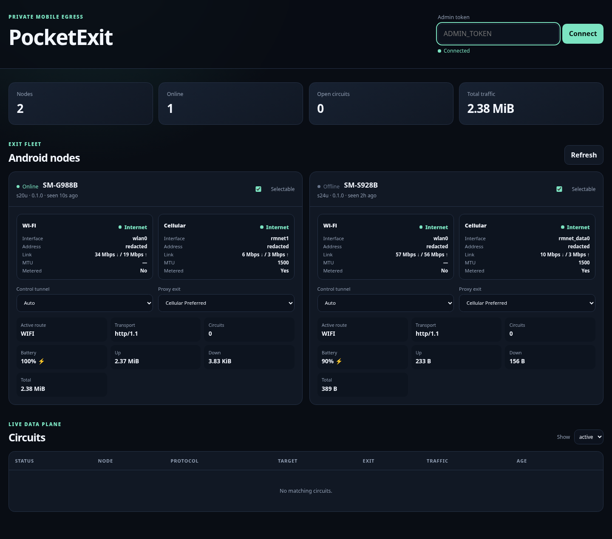

<details>
<summary>Mobile layout</summary>

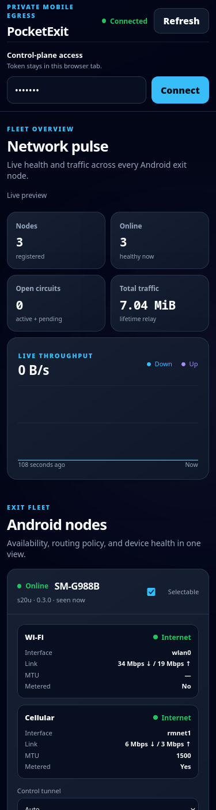

</details>

It shows online/selectable state, Wi-Fi and cellular validation with addresses,
interface, MTU, metering and estimated link rates, the active control route and
negotiated HTTP protocol, battery and charging, live circuits with byte
counters, remote enable/disable and policy selection, and circuit termination.
The admin token lives only in `sessionStorage`.

---

## Quick start

### Prerequisites

- Docker Engine with the Compose plugin, and OpenSSL
- A DNS name pointing at the server for a real deployment
- TCP 80, TCP/UDP 443, TCP 1080 and UDP 12000–12031 open through the firewall
- For the app: Android Studio, or JDK 17 plus an SDK with API 36

### 1. Server

```bash
DOMAIN=proxy.example.com make setup   # writes .env (mode 600) + dev certificates
$EDITOR .env                          # review the generated credentials
docker compose up --build -d
```

Validate:

```bash
curl -k https://127.0.0.1/api/v1/health
docker compose exec nginx nginx -t
docker compose ps
```

`-k` exists only for the generated development certificate. It is not a
production trust strategy.

<details>
<summary>Production TLS</summary>

Replace `nginx/certs/server.crt` and `nginx/certs/server.key` with a certificate
and key trusted by Android's system trust store. The Nginx container
deliberately does not automate ACME issuance, so renewal can be wired into
whatever certificate workflow the server already runs, without changing
PocketExit. The release build trusts system CAs only; the debug build also
accepts user-installed CAs for local testing.

</details>

<details>
<summary>Optional: PhotonSpark-hosted HTTP endpoint (no inbound firewall rule)</summary>

Add the one-time connector token to `.env` as `SPARK_TUNNEL_TOKEN`. The bundled
connector publishes the dashboard, API and agent heartbeat/control traffic
through `https://exit.photonspark.ro`.

```bash
docker compose --profile tunnel -f docker-compose.yml -f docker-compose.tunnel.yml up --build -d
```

SparkTunnel does **not** carry raw SOCKS5 TCP or the UDP relay ports, and its
HTTP transport does not preserve long-lived circuit bodies. Use the direct Nginx
host mappings for working TCP/UDP circuits until the circuit protocol speaks
WebSockets.

</details>

### 2. Phones

```bash
cd android
./gradlew testDebugUnitTest lintDebug assembleDebug
# → android/app/build/outputs/apk/debug/app-debug.apk
```

Copy the APK to each phone over USB, cloud storage, or a browser download — no
ADB required — then open it and approve installation from that source. With
development certificates, also install `nginx/certs/ca.crt` as a user CA and use
only the debug APK with it.

`.env` contains `AGENT_TOKENS_JSON={"s20u":"…","s22u":"…","s24u":"…"}`. On each
phone, enter:

| Field | Example |
|---|---|
| Backend URL | `https://proxy.example.com` |
| Node ID | `s20u`, `s22u`, or `s24u` |
| Agent token | The matching value from `AGENT_TOKENS_JSON` |
| Control tunnel | Wi-Fi preferred |
| Proxy exit | Cellular only, or Cellular preferred |

Android can request the cellular transport but cannot pin the modem to 5G NR.
The carrier may serve LTE when NR is unavailable.

### 3. Use it

```bash
# automatic node selection
curl --proxy socks5h://proxy.example.com:1080 \
     --proxy-user 'proxy:PASSWORD' https://api.ipify.org

# a specific phone
curl --proxy socks5h://proxy.example.com:1080 \
     --proxy-user 'proxy@s24u:PASSWORD' https://api.ipify.org

# a specific phone, forced onto its SIM for this circuit only
curl --proxy socks5h://proxy.example.com:1080 \
     --proxy-user 'proxy@s24u!cellular:PASSWORD' https://api.ipify.org
```

The username *is* the control surface:

```text
proxy @ s24u ! cellular
  │      │        │
  │      │        └── exit policy, this circuit only
  │      └─────────── which phone must serve it
  └────────────────── SOCKS_USERNAME
```

All four forms are valid: `proxy`, `proxy@NODE_ID`, `proxy!POLICY`,
`proxy@NODE_ID!POLICY`.

| Alias | Resolves to |
|---|---|
| `auto` | `AUTO` |
| `wifi`, `wifi_only` | `WIFI_ONLY` |
| `cell`, `cellular`, `lte`, `5g`, `cellular_only` | `CELLULAR_ONLY` |
| `wifi_preferred` | `WIFI_PREFERRED` |
| `cellular_preferred`, `cell_preferred` | `CELLULAR_PREFERRED` |

`5g` is only an alias for `CELLULAR_ONLY`. It does not promise the modem is on
NR rather than LTE.

> [!WARNING]
> `:1080` is plain SOCKS5 over raw TCP. RFC 1929 does not encrypt the
> username/password exchange. Restrict TCP 1080 to trusted sources, reach it
> through a VPN or SSH tunnel, or put a client-side TLS wrapper in front of it.
> HTTPS destinations keep their own end-to-end TLS either way, but the SOCKS
> credentials themselves are exposed to the network path.

A client implementing UDP ASSOCIATE gets one authenticated relay port from
12000–12031 per association.

---

## Configuration

Everything is environment-driven, read once at boot, and validated before the
listeners open.

| Variable | Default | Purpose |
|---|---|---|
| `PUBLIC_PROXY_HOST` | `127.0.0.1` | Host clients see in UDP ASSOCIATE replies. DNS name or IP, no port |
| `ADMIN_TOKEN` | — | Dashboard and `/api/v1/*` bearer token. 16–4096 bytes |
| `SOCKS_USERNAME` | `proxy` | Base username before any `@node!policy` selector |
| `SOCKS_PASSWORD` | — | SOCKS5 password. 16–255 bytes |
| `AGENT_TOKENS_JSON` | — | **Required.** `{"node_id":"token"}`, one per phone |
| `HTTP_ADDR` | `:8080` | Internal API listener |
| `SOCKS_ADDR` | `:1080` | SOCKS5 listener |
| `UDP_BIND_HOST` | `0.0.0.0` | Bind address for relay ports |
| `UDP_PORT_START` / `UDP_PORT_END` | `12000` / `12031` | Relay pool, max span 1024 |
| `NODE_OFFLINE_AFTER` | `45s` | Heartbeat age that marks a node offline |
| `COMMAND_WAIT` | `5s` | Control long-poll duration before `204` |
| `OPEN_TIMEOUT` | `45s` | Wait for the phone to confirm a circuit |
| `IDLE_TIMEOUT` | `2m` | UDP association idle deadline |
| `MAX_CIRCUITS_PER_NODE` | `128` | Per-node concurrent circuit ceiling |
| `ALLOW_PRIVATE_DESTINATIONS` | `false` | Keep `false` for an Internet exit pool |
| `LOG_JSON` | `true` | JSON handler when `true`, plain text when `false` |
| `LOG_LEVEL` | `info` | Set to `debug` for verbose handler logs |
| `SPARK_TUNNEL_TOKEN` | — | Only for the optional `tunnel` Compose profile |

---

## API surface

| Method | Path | Auth | Purpose |
|---|---|---|---|
| `GET` | `/api/v1/health` | none | Liveness |
| `GET` | `/api/v1/nodes` | admin | Node inventory with full telemetry |
| `PATCH` | `/api/v1/nodes/{nodeID}` | admin | Enable/disable, set control and exit policy |
| `GET` | `/api/v1/circuits` | admin | Circuit inventory |
| `DELETE` | `/api/v1/circuits/{circuitID}` | admin | Close a circuit |
| `GET` | `/api/v1/metrics` | admin | Prometheus text metrics |
| `POST` | `/agent/v1/heartbeat` | node | Register and report telemetry |
| `GET` | `/agent/v1/control` | node | Long poll for the next command |
| `POST` | `/agent/v1/circuits/{id}/status` | node | `connected` / `failed` / `closed` |
| `GET` | `/agent/v1/circuits/{id}/down` | node | Streaming server → phone bytes |
| `POST` | `/agent/v1/circuits/{id}/up` | node | Streaming phone → server bytes |

A policy `PATCH` is transactional: if the command queue for that node is full,
the dashboard state is rolled back rather than drifting from the phone.
Full request and response shapes live in [PROTOCOL.md](PROTOCOL.md).

---

## Repository layout

```text
android/              Android Studio / Gradle project (Kotlin, Compose, Cronet)
  …/network/          NetworkMonitor · PolicySelector · CronetTransport · DestinationAcl
  …/proxy/            CircuitManager · DatagramCodec
  …/service/          ExitNodeService foreground service · BootReceiver
backend/              Go control plane and SOCKS5 proxy
  internal/proxy/     SOCKS5 CONNECT + UDP ASSOCIATE, selector parsing
  internal/nodes/     Registry, command queues, scheduler
  internal/circuit/   Circuit pipes, state, per-node ceiling, pruning
  internal/security/  Destination ACL
  internal/httpapi/   Admin and agent HTTP surface
frontend/             Static dependency-free dashboard
nginx/                Image, configuration, local certificates
scripts/              Setup, validation, smoke-test, packaging
docs/images/          Redacted live dashboard captures
docker-compose.yml    Complete server deployment
ARCHITECTURE.md       Component and data-flow design
PROTOCOL.md           HTTP and circuit protocol
SECURITY.md           Threat model and deployment checklist
TEST-REPORT.md        Verification performed for this handoff
```

---

## Tests

```bash
make test          # Go unit + race + coverage, backend smoke, frontend syntax, YAML/XML/shell checks
make test-android  # Gradle unit tests, lint, debug APK
make test-docker   # Compose build, startup, health check, nginx -t
```

CI runs all three groups on every push and pull request, and uploads the debug
APK as a build artifact.

---

## Limits, stated plainly

- **State is in memory.** Restarting the backend clears node records and circuit
  history. Phones re-register on their next heartbeat.
- **Circuits do not survive a control-network change.** They close; the agent
  reconnects and accepts new ones.
- **UDP is length-framed over reliable HTTP/3 streams**, not QUIC DATAGRAM or
  MASQUE. Order and delivery hold, but loss adds head-of-line latency.
- **The UDP relay pool has a first-packet race.** A port is created only after
  an authenticated `UDP ASSOCIATE` and locks to the first source endpoint it
  sees, but the port range is fixed and public. Firewall 12000–12031 to trusted
  clients, or do not publish it when UDP is unnecessary.
- **OEM battery management can still kill the foreground service.** Exempting
  the app from battery optimisation is a manual step in device settings.
- **HTTP/3 is opportunistic.** A path blocking UDP 443 falls back to HTTPS over
  TCP. Watch `transport_protocol` in the telemetry if that matters.
- **Not implemented:** multi-user tenancy, billing, persistent audit storage,
  mTLS, automatic certificate issuance, horizontal replication.
- **Legal:** carrier terms and local law may restrict proxying or sustained
  tethering-like traffic. Use only devices, SIMs, accounts, and services you own
  and are authorised to operate.

Read [SECURITY.md](SECURITY.md) before exposing any of this to the Internet.

---

## License

[MIT](LICENSE)
