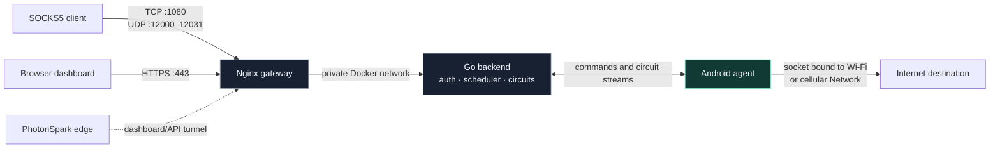
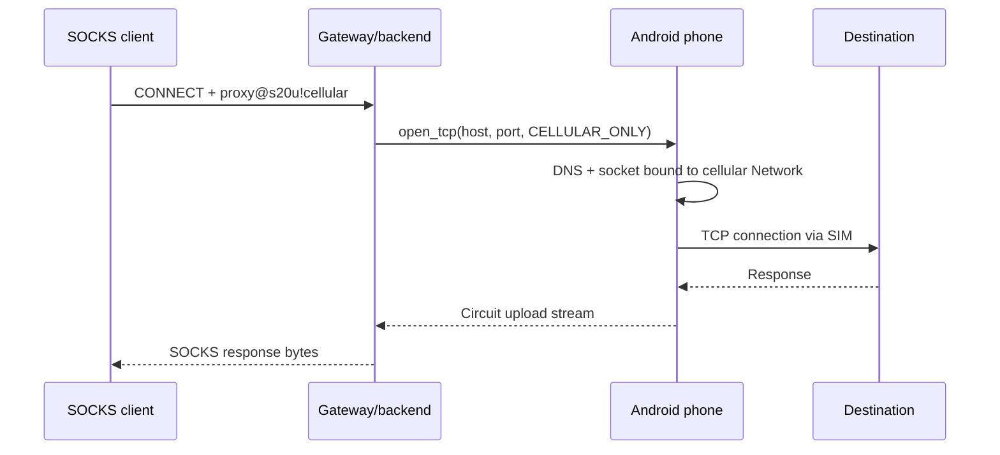

# PocketExit

[](https://github.com/CesarPetrescu/PocketExit/actions/workflows/ci.yml)
[](https://github.com/CesarPetrescu/PocketExit/releases/latest)
[](LICENSE)

PocketExit turns Android phones you own into selectable private Internet exit
nodes. A client connects to one authenticated SOCKS5 gateway, chooses a phone
and an exit policy, and the phone opens the destination through Wi-Fi or mobile
data.

**[Download the latest APK](https://github.com/CesarPetrescu/PocketExit/releases/latest)** ·
**[Open the live dashboard](https://exit.photonspark.ro)** ·
**[Read the security checklist](SECURITY.md)**

> [!IMPORTANT]
> The v0.2.0 APK is debug-signed. SparkTunnel 0.3.0 works for the dashboard,
> API, phone heartbeats, and short requests, but its HTTP path currently cuts
> sustained circuit streams after about 16–17 seconds. Use direct Nginx ingress
> for normal SOCKS5 traffic.

The Android implementation uses ordinary public Android APIs only:

- no root;
- no ADB dependency;
- no `VpnService`;
- no process-wide route changes;
- no custom ROM or device-owner mode.

## Architecture



Only `nginx` publishes host ports in `docker-compose.yml`. The Go process is reachable only on the internal Compose network.

For every phone, the control route and exit route are independent. Typical operation is:

```text
Android ↔ gateway control/data transport: Wi-Fi preferred
Android → destination socket:             cellular only
```

If Wi-Fi disappears, the control connection can reconnect through cellular while destination sockets remain governed by their own exit policy.

### One forced-cellular request



## Verified on a real Galaxy S20 Ultra

On 2026-08-10, a USB-debugged Samsung **SM-G988B** (`s20u`) ran the Android
agent against the live deployment. Wi-Fi (`wlan0`) carried control traffic and
cellular (`rmnet1`) was independently validated for exit traffic.

The exact selector used was:

```bash
curl --proxy socks5h://proxy.example.com:1080 \
  --proxy-user 'proxy@s20u!cellular:YOUR_SOCKS_PASSWORD' \
  http://v4.ident.me
# [cellular public IPv4 redacted]
```

The returned address matched the phone's cellular egress rather than its Wi-Fi
connection. Follow-up transfer probes recorded the current SparkTunnel limit:

| Probe through `s20u!cellular` | Result | Bytes received | Duration |
|---|---:|---:|---:|
| `v4.ident.me` public-IP check | Passed | Complete response | Short request |
| Hetzner `100MB.bin` | Stream closed | 1,982,208 bytes | 17.16 s |
| Hetzner `1GB.bin` | Stream closed | 474,878 bytes | 17.11 s |

Both large probes received HTTP 200 before SparkTunnel ended the TLS stream
with an unexpected EOF. This proves phone selection and cellular routing work,
but it is not a throughput benchmark and it does not claim large-transfer
support through the hosted tunnel.

## Dashboard access

PocketExit has one responsive administration page for fleet status, network
validation, route policies, battery/traffic telemetry, and active circuits.
These captures came from the live deployment; tokens, IP addresses, DNS
servers, circuit IDs, and destinations were removed before the images were
written. The test phone still had app v0.1.0 installed during capture; the
current downloadable APK is v0.2.0.


<details>
<summary>Mobile layout</summary>


</details>

## Implemented features

### Android agent

- Kotlin and Jetpack Compose.
- Foreground service with a persistent notification.
- Simultaneous Wi-Fi and cellular `Network` tracking.
- `AUTO`, `WIFI_ONLY`, `CELLULAR_ONLY`, `WIFI_PREFERRED`, and `CELLULAR_PREFERRED` policies.
- Per-request Cronet binding to the selected control `Network`.
- HTTP/3/QUIC support through embedded Cronet.
- Destination DNS and TCP/UDP sockets bound to the selected exit `Network`.
- TCP circuits and connected UDP circuits.
- Android Keystore encryption for the agent token.
- Optional start after reboot.
- Network, traffic, battery, route, circuit, and negotiated-protocol telemetry.

### Go backend

- Authenticated SOCKS5 CONNECT and UDP ASSOCIATE.
- Automatic or explicit phone selection.
- Per-request exit-policy override in the SOCKS username.
- Authenticated node registration, long polling, and circuit streams.
- In-memory node registry and circuit manager.
- Private/local destination blocking by default.
- Admin API, health endpoint, and Prometheus-text metrics.
- Graceful shutdown, timeouts, connection limits, and stale-circuit pruning.

### Gateway and dashboard

- One Nginx container for all public ingress.
- TLS, HTTP/2, and HTTP/3/QUIC on port 443.
- Static dependency-free administration dashboard.
- TCP stream proxy for SOCKS5.
- Dedicated UDP relay port pool.
- Read-only containers and `no-new-privileges` in Compose.

## Repository layout

```text
android/             Android Studio / Gradle project
backend/             Go control plane and SOCKS5 proxy
docs/images/          Redacted live dashboard captures
frontend/            Static dashboard
nginx/               Nginx image, configuration, and local certificates
scripts/             Setup, validation, smoke-test, and packaging scripts
docker-compose.yml   Complete server deployment
ARCHITECTURE.md       Component and data-flow design
PROTOCOL.md           HTTP and circuit protocol
SECURITY.md           Threat model and deployment checklist
TEST-REPORT.md        Verification performed for this handoff
```

## Server quick start

### Prerequisites

- Docker Engine with the Compose plugin;
- OpenSSL;
- a DNS name pointing to the server for normal deployment;
- TCP 80, TCP/UDP 443, TCP 1080, and UDP 12000–12031 allowed through the firewall.

Generate random credentials and development certificates:

```bash
DOMAIN=proxy.example.com make setup
```

Review the generated `.env`:

```bash
chmod 600 .env
```

Start the services:

```bash
docker compose up --build -d
```

For a PhotonSpark-hosted HTTP endpoint, add the one-time connector token to
`.env` as `SPARK_TUNNEL_TOKEN`. The included connector publishes the dashboard,
API, and Android heartbeat/control traffic through `https://exit.photonspark.ro`
without an inbound firewall rule. SparkTunnel does not carry the raw SOCKS5 TCP
or UDP relay ports, and its HTTP transport does not preserve PocketExit's
long-lived circuit body streams. Use the direct Nginx host mappings for working
TCP/UDP circuits until the circuit protocol supports WebSockets.

To run only through SparkTunnel without publishing any host ports:

```bash
docker compose --profile tunnel -f docker-compose.yml -f docker-compose.tunnel.yml up --build -d
```

Validate them:

```bash
curl -k https://127.0.0.1/api/v1/health
docker compose exec nginx nginx -t
docker compose ps
```

The `-k` option is only for the generated development certificate. Do not use it as a production trust strategy.

### Production TLS

For production, replace:

```text
nginx/certs/server.crt
nginx/certs/server.key
```

with a certificate and key trusted by Android's system trust store. The Nginx container deliberately does not automate ACME issuance. Certificate renewal can therefore be integrated with the certificate workflow already used on the server without changing PocketExit.

The release Android build trusts system certificate authorities only. The debug build additionally permits user-installed certificate authorities for local testing.

## Build and install the Android application

Use Android Studio or JDK 17 plus an Android SDK containing API 36.

```bash
cd android
./gradlew testDebugUnitTest lintDebug assembleDebug
```

The debug APK is produced at:

```text
android/app/build/outputs/apk/debug/app-debug.apk
```

To install without ADB, copy the APK to each phone using USB file transfer, cloud storage, a browser download, or another normal file-transfer method. Open the APK on the phone and approve installation from that source.

For development certificates, also copy `nginx/certs/ca.crt` to the phone and install it as a user CA through Android Settings. Use only the debug APK with this CA. A production/release APK should use a publicly trusted server certificate instead.

### Configure the three phones

The generated `.env` contains entries similar to:

```text
AGENT_TOKENS_JSON={"s20u":"...","s22u":"...","s24u":"..."}
```

On each phone enter:

| Field | Example |
|---|---|
| Backend URL | `https://proxy.example.com` |
| Node ID | `s20u`, `s22u`, or `s24u` |
| Agent token | Matching value from `AGENT_TOKENS_JSON` |
| Control tunnel | `Wi-Fi preferred` |
| Proxy exit | `Cellular only` or `Cellular preferred` |

`CELLULAR_ONLY` fails the circuit rather than silently leaking it through Wi-Fi. `CELLULAR_PREFERRED` falls back to Wi-Fi when cellular is unavailable.

Android can request the cellular transport but cannot force the radio to stay specifically on 5G NR. The carrier/modem may use LTE when 5G is unavailable.

## Use the proxy

The public `:1080` listener is standard SOCKS5 over raw TCP. SOCKS5 does not encrypt its username/password exchange or non-TLS destination traffic. Restrict TCP 1080 to trusted source addresses, access it through a VPN/SSH tunnel, or place a client-side TLS wrapper in front of it. HTTPS destinations still provide their own end-to-end TLS, but the SOCKS credentials themselves otherwise remain exposed to the network path.

Default automatic node selection:

```bash
curl --proxy socks5h://proxy.example.com:1080 \
  --proxy-user 'proxy:YOUR_SOCKS_PASSWORD' \
  https://api.ipify.org
```

Select a specific phone:

```bash
curl --proxy socks5h://proxy.example.com:1080 \
  --proxy-user 'proxy@s24u:YOUR_SOCKS_PASSWORD' \
  https://api.ipify.org
```

Select a phone and force cellular for that circuit:

```bash
curl --proxy socks5h://proxy.example.com:1080 \
  --proxy-user 'proxy@s24u!cellular:YOUR_SOCKS_PASSWORD' \
  https://api.ipify.org
```

Supported username forms:

```text
proxy
proxy@NODE_ID
proxy!POLICY
proxy@NODE_ID!POLICY
```

Policy aliases:

```text
auto
wifi
cellular, cell, lte, 5g
wifi_preferred
cellular_preferred
```

The `5g` alias means `CELLULAR_ONLY`; it does not guarantee that the modem is currently using NR rather than LTE.

A SOCKS5 client that implements UDP ASSOCIATE can use UDP. The server allocates one authenticated relay port from 12000–12031 for each association.

## Dashboard

Open:

```text
https://proxy.example.com/
```

Enter `ADMIN_TOKEN` from `.env`. The browser retains it only in `sessionStorage`, so it is cleared when that browser session ends.

The dashboard shows:

- online/offline and selectable state;
- Wi-Fi and cellular validation, addresses, interface, MTU, metering, and estimated link rates;
- active control route and negotiated HTTP protocol;
- battery/charging status;
- active circuits and traffic counters;
- remote control and exit-policy selection;
- circuit termination.

## Tests

Core tests that do not require Docker or an Android SDK:

```bash
make test
```

Android build, unit tests, and lint:

```bash
make test-android
```

Compose build, startup, health check, and Nginx configuration test:

```bash
make test-docker
```

The GitHub Actions workflow runs all three groups on a fully provisioned runner.

## Operational limitations

- State is in memory. Restarting the Go backend clears node records and circuit history; phones re-register automatically.
- TCP and UDP circuits are not resumed after an Android control-network change. They close, while the agent reconnects and accepts new circuits.
- UDP payloads are length-framed over reliable HTTP/3 request streams. This preserves order and delivery but is not equivalent to QUIC DATAGRAM/MASQUE and can add latency during packet loss.
- SOCKS5 UDP relay datagrams do not carry reusable credentials. Each relay port is created only after authenticated `UDP ASSOCIATE` and locks to its first observed Nginx upstream session, but the fixed public port pool remains susceptible to a first-packet race. Keep UDP 12000–12031 firewalled to trusted clients or a VPN, and do not publish the range when UDP is unnecessary.
- The Android foreground service improves survivability, but some OEM battery-management policies may still stop it. Exempting the app from battery optimization can be done manually in device settings.
- The project does not implement multi-user tenancy, billing, persistent audit storage, mTLS, or automatic certificate issuance.
- Carrier terms and local laws may restrict proxying or sustained tethering-like traffic. Use only devices, SIMs, accounts, and services you control and are authorized to operate.

See [SECURITY.md](SECURITY.md) before exposing the service to the Internet.
